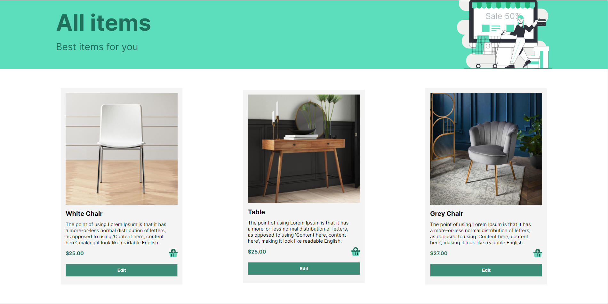
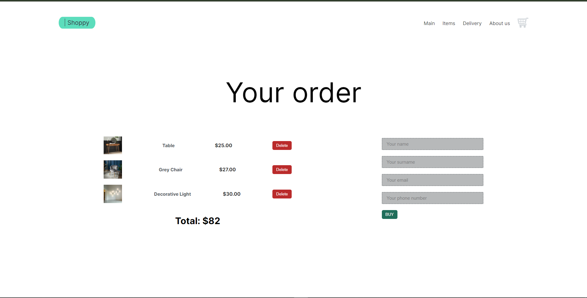
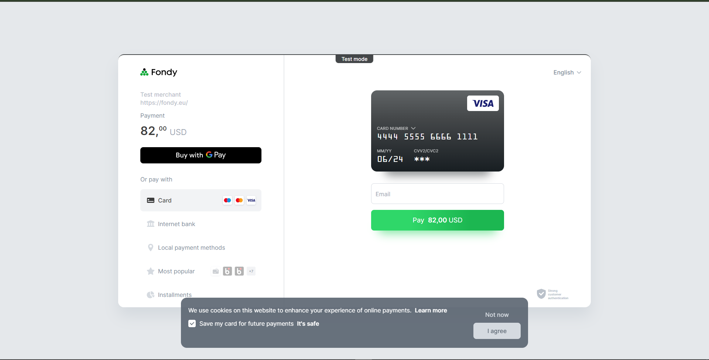

# Project: Online Store - Shoppy

A classic example of an online store, with the ability to create an order. 

The page includes: 
- the ability to add items to the cart and remove them;
- several static pages (homepage, about us, delivery);
- the ability to edit products (price, description, etc.);
- the ability to create order and pay for it using the Fondy service.

## Technologies:








## Recommended IDE Setup

[VSCode](https://code.visualstudio.com/) + [Volar](https://marketplace.visualstudio.com/items?itemName=Vue.volar) (and disable Vetur) + [TypeScript Vue Plugin (Volar)](https://marketplace.visualstudio.com/items?itemName=Vue.vscode-typescript-vue-plugin).


## Project launch:
* Clone the project to your computer from Github using the command:
```
git clone https://github.com/kirchman1/Shoppy.git
```

* Install dependencies using the command:
```
npm install
```

* Launch the project using the command:
```
npm run dev
python manage.py runserver
```